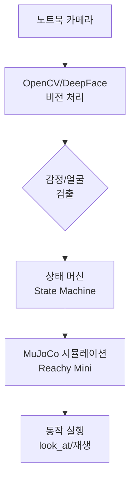

# Week 07: 비전과 동작 통합 (시뮬레이션 환경)

## 학습 목표

- 노트북 카메라와 MuJoCo 시뮬레이션을 연동한 비전-동작 통합
- 실시간 감정 인식 기반 시뮬레이션 로봇 제어
- 하드웨어 없이 완전한 상호작용 시스템 구축

---

## 1. 개요

이번 주차에서는 **노트북 카메라**(웹캠)로 사람의 얼굴과 감정을 인식하고, **MuJoCo 시뮬레이션**에서 Reachy Mini 로봇이 반응하도록 하는 통합 시스템을 구축합니다.

### 시스템 아키텍처



### 필요한 구성 요소

| 구성 요소 | 역할 | 비고 |
|----------|------|------|
| **노트북 웹캠** | 사람 얼굴 및 감정 캡처 | OpenCV로 접근 |
| **OpenCV** | 얼굴 검출 및 영상 처리 | cv2.VideoCapture(0) |
| **DeepFace/YOLO** | 감정 인식 | 선택적 |
| **MuJoCo 시뮬레이션** | Reachy Mini 로봇 동작 시뮬레이션 | reachy-mini-daemon --sim |
| **Reachy Mini SDK** | 로봇 제어 API | ReachyMini() |

---

## 2. 환경 설정

### 2.1 시뮬레이션 시작

터미널 1에서 MuJoCo 시뮬레이션을 먼저 실행합니다:

```bash
# 가상환경 활성화
.venv\Scripts\activate

# MuJoCo 시뮬레이션 시작
reachy-mini-daemon --sim

# 또는 오브젝트가 있는 씬으로 시작
reachy-mini-daemon --sim --scene minimal
```

시뮬레이션이 성공적으로 실행되면 `http://localhost:8000`에서 웹 뷰어를 확인할 수 있습니다.

### 2.2 필요한 패키지 설치

터미널 2에서 추가 패키지를 설치합니다:

```bash
# OpenCV (이미 설치되어 있을 수 있음)
uv pip install opencv-python

# 감정 인식용 DeepFace (선택사항)
uv pip install deepface

# 또는 경량 감정 인식용 FER
uv pip install fer
```

---

## 3. 노트북 카메라 설정

### 3.1 웹캠 접근 테스트

먼저 노트북 카메라가 제대로 작동하는지 확인합니다:

```python
import cv2

# 노트북 카메라 연결 (0은 기본 카메라)
cap = cv2.VideoCapture(0)

if not cap.isOpened():
    print("카메라를 열 수 없습니다!")
    exit()

print("카메라가 정상적으로 열렸습니다. 'q' 키를 눌러 종료하세요.")

while True:
    ret, frame = cap.read()
    
    if not ret:
        print("프레임을 읽을 수 없습니다!")
        break
    
    # 프레임 표시
    cv2.imshow('Laptop Camera Test', frame)
    
    # 'q' 키를 누르면 종료
    if cv2.waitKey(1) & 0xFF == ord('q'):
        break

cap.release()
cv2.destroyAllWindows()
```

### 3.2 카메라 설정 최적화

얼굴 인식 성능을 위해 카메라 해상도와 FPS를 설정합니다:

```python
import cv2

cap = cv2.VideoCapture(0)

# 해상도 설정 (640x480이 얼굴 인식에 적합)
cap.set(cv2.CAP_PROP_FRAME_WIDTH, 640)
cap.set(cv2.CAP_PROP_FRAME_HEIGHT, 480)

# FPS 설정 (30fps)
cap.set(cv2.CAP_PROP_FPS, 30)

# 설정 확인
width = int(cap.get(cv2.CAP_PROP_FRAME_WIDTH))
height = int(cap.get(cv2.CAP_PROP_FRAME_HEIGHT))
fps = int(cap.get(cv2.CAP_PROP_FPS))

print(f"카메라 설정: {width}x{height} @ {fps}fps")
```

---

## 4. 비전과 시뮬레이션 통합

### 4.1 얼굴 검출 및 시뮬레이션 연동

노트북 카메라에서 얼굴을 검출하고, MuJoCo 시뮬레이션의 로봇이 해당 방향을 바라보도록 합니다:

```python
import cv2
import time
from reachy_mini import ReachyMini

# MuJoCo 시뮬레이션에 연결
reachy = ReachyMini()

# 노트북 카메라 열기
cap = cv2.VideoCapture(0)
cap.set(cv2.CAP_PROP_FRAME_WIDTH, 640)
cap.set(cv2.CAP_PROP_FRAME_HEIGHT, 480)

# Haar Cascade 얼굴 검출기 로드
face_cascade = cv2.CascadeClassifier(
    cv2.data.haarcascades + 'haarcascade_frontalface_default.xml'
)

print("노트북 카메라로 얼굴을 인식합니다. 'q' 키로 종료.")

try:
    while True:
        ret, frame = cap.read()
        if not ret:
            continue
        
        # 그레이스케일 변환
        gray = cv2.cvtColor(frame, cv2.COLOR_BGR2GRAY)
        
        # 얼굴 검출
        faces = face_cascade.detectMultiScale(gray, 1.1, 4)
        
        for (x, y, w, h) in faces:
            # 얼굴에 사각형 그리기
            cv2.rectangle(frame, (x, y), (x+w, y+h), (0, 255, 0), 2)
            
            # 얼굴 중심 좌표
            center_x = x + w // 2
            center_y = y + h // 2
            
            # 이미지 중심을 기준으로 상대 위치 계산
            img_h, img_w = frame.shape[:2]
            offset_x = (center_x - img_w / 2) / img_w
            offset_y = (center_y - img_h / 2) / img_h
            
            # MuJoCo 시뮬레이션에서 로봇이 바라볼 좌표 계산
            # (간단한 매핑: 화면 좌우 -> 로봇 Y축, 화면 상하 -> 로봇 Z축)
            target_x = 0.5  # 로봇 앞 50cm
            target_y = -offset_x * 0.3  # 좌우 최대 ±30cm
            target_z = -offset_y * 0.3 + 0.3  # 상하 조정 (기본 높이 30cm)
            
            # 시뮬레이션 로봇이 해당 위치 바라보기
            reachy.head.look_at(x=target_x, y=target_y, z=target_z, duration=0.3)
            
            # 화면에 좌표 표시
            cv2.putText(frame, f"Target: ({target_x:.2f}, {target_y:.2f}, {target_z:.2f})",
                        (10, 30), cv2.FONT_HERSHEY_SIMPLEX, 0.6, (255, 255, 0), 2)
        
        # 프레임 표시
        cv2.imshow('Laptop Camera - Face Tracking', frame)
        
        if cv2.waitKey(1) & 0xFF == ord('q'):
            break

finally:
    cap.release()
    cv2.destroyAllWindows()
```

---

## 5. 감정 인식과 동작 재생

### 5.1 DeepFace를 이용한 감정 인식

```python
from deepface import DeepFace
import cv2
import time
from reachy_mini import ReachyMini

reachy = ReachyMini()
cap = cv2.VideoCapture(0)

# 감정별 동작 매핑 (6주차에서 녹화한 동작 파일 활용)
EMOTION_ACTIONS = {
    'happy': 'wave_hand.json',
    'sad': 'comfort.json',
    'surprise': 'surprised.json',
    'neutral': 'idle.json'
}

print("감정 인식 시스템 시작. 'q' 키로 종료.")

last_emotion_time = 0
emotion_cooldown = 5  # 5초마다 감정 재인식

try:
    while True:
        ret, frame = cap.read()
        if not ret:
            continue
        
        current_time = time.time()
        
        # 일정 시간마다 감정 분석 (성능 고려)
        if current_time - last_emotion_time > emotion_cooldown:
            try:
                # DeepFace로 감정 분석
                results = DeepFace.analyze(frame, actions=['emotion'], 
                                          enforce_detection=False)
                
                if results:
                    dominant_emotion = results[0]['dominant_emotion']
                    print(f"감지된 감정: {dominant_emotion}")
                    
                    # 시뮬레이션 로봇이 감정에 맞는 동작 실행
                    # (여기서는 단순 예시 - 실제로는 MotionPlayer 클래스 활용)
                    if dominant_emotion in EMOTION_ACTIONS:
                        action_file = EMOTION_ACTIONS[dominant_emotion]
                        print(f"동작 실행: {action_file}")
                        # player.play_from_file(action_file)  # 6주차 구현 활용
                    
                    # 화면에 감정 표시
                    cv2.putText(frame, f"Emotion: {dominant_emotion}", 
                                (10, 30), cv2.FONT_HERSHEY_SIMPLEX, 
                                1.0, (0, 255, 0), 2)
                    
                    last_emotion_time = current_time
                    
            except Exception as e:
                print(f"감정 분석 오류: {e}")
        
        cv2.imshow('Emotion Recognition', frame)
        
        if cv2.waitKey(1) & 0xFF == ord('q'):
            break

finally:
    cap.release()
    cv2.destroyAllWindows()
```

### 5.2 경량화된 FER 라이브러리 사용

DeepFace 대신 더 빠른 FER(Facial Emotion Recognition) 라이브러리를 사용할 수도 있습니다:

```python
from fer import FER
import cv2
from reachy_mini import ReachyMini

reachy = ReachyMini()
cap = cv2.VideoCapture(0)

# FER 감정 인식기 초기화
emotion_detector = FER(mtcnn=True)

try:
    while True:
        ret, frame = cap.read()
        if not ret:
            continue
        
        # 감정 분석
        emotions = emotion_detector.detect_emotions(frame)
        
        if emotions:
            # 가장 큰 얼굴의 감정 추출
            top_emotion = emotions[0]['emotions']
            dominant = max(top_emotion, key=top_emotion.get)
            
            # 결과 표시
            cv2.putText(frame, f"Emotion: {dominant}", 
                        (10, 30), cv2.FONT_HERSHEY_SIMPLEX, 
                        1.0, (0, 255, 255), 2)
            
            print(f"감지된 감정: {dominant} ({top_emotion[dominant]:.2%})")
        
        cv2.imshow('FER Emotion Detection', frame)
        
        if cv2.waitKey(1) & 0xFF == ord('q'):
            break

finally:
    cap.release()
    cv2.destroyAllWindows()
```

---

## 6. 전체 통합 시스템 구현

### 6.1 상태 머신 기반 상호작용 시스템

```python
import cv2
import time
from fer import FER
from reachy_mini import ReachyMini
from enum import Enum

class RobotState(Enum):
    IDLE = "idle"
    DETECTING_FACE = "detecting_face"
    TRACKING_FACE = "tracking_face"
    REACTING_EMOTION = "reacting_emotion"

class InteractionSystem:
    def __init__(self):
        self.reachy = ReachyMini()
        self.cap = cv2.VideoCapture(0)
        self.cap.set(cv2.CAP_PROP_FRAME_WIDTH, 640)
        self.cap.set(cv2.CAP_PROP_FRAME_HEIGHT, 480)
        
        self.face_cascade = cv2.CascadeClassifier(
            cv2.data.haarcascades + 'haarcascade_frontalface_default.xml'
        )
        self.emotion_detector = FER(mtcnn=False)  # 빠른 검출을 위해 MTCNN 비활성화
        
        self.state = RobotState.IDLE
        self.last_face_time = 0
        self.last_emotion_time = 0
        
    def process_frame(self):
        ret, frame = self.cap.read()
        if not ret:
            return None
        
        gray = cv2.cvtColor(frame, cv2.COLOR_BGR2GRAY)
        faces = self.face_cascade.detectMultiScale(gray, 1.1, 4)
        
        current_time = time.time()
        
        if len(faces) > 0:
            self.last_face_time = current_time
            self.state = RobotState.TRACKING_FACE
            
            # 얼굴 추적
            (x, y, w, h) = faces[0]
            cv2.rectangle(frame, (x, y), (x+w, y+h), (0, 255, 0), 2)
            
            # 로봇 시선 추적
            center_x = x + w // 2
            center_y = y + h // 2
            img_h, img_w = frame.shape[:2]
            
            offset_x = (center_x - img_w / 2) / img_w
            offset_y = (center_y - img_h / 2) / img_h
            
            target_x = 0.5
            target_y = -offset_x * 0.3
            target_z = -offset_y * 0.3 + 0.3
            
            self.reachy.head.look_at(x=target_x, y=target_y, z=target_z, duration=0.2)
            
            # 3초마다 감정 인식
            if current_time - self.last_emotion_time > 3.0:
                self.analyze_emotion(frame)
                self.last_emotion_time = current_time
        else:
            # 얼굴이 5초 이상 보이지 않으면 IDLE 상태로
            if current_time - self.last_face_time > 5.0:
                self.state = RobotState.IDLE
        
        # 상태 표시
        cv2.putText(frame, f"State: {self.state.value}", 
                    (10, 30), cv2.FONT_HERSHEY_SIMPLEX, 
                    0.7, (255, 255, 0), 2)
        
        return frame
    
    def analyze_emotion(self, frame):
        try:
            emotions = self.emotion_detector.detect_emotions(frame)
            if emotions:
                top_emotion = emotions[0]['emotions']
                dominant = max(top_emotion, key=top_emotion.get)
                confidence = top_emotion[dominant]
                
                print(f"감정: {dominant} ({confidence:.2%})")
                
                # 감정에 따른 동작 실행 (여기서는 로그만 출력)
                # 실제 구현 시 6주차 MotionPlayer 활용
                if dominant == 'happy' and confidence > 0.5:
                    print("→ 기쁜 동작 실행!")
                elif dominant == 'sad' and confidence > 0.5:
                    print("→ 위로 동작 실행!")
                    
        except Exception as e:
            print(f"감정 분석 오류: {e}")
    
    def run(self):
        print("통합 상호작용 시스템 시작")
        print("- 노트북 카메라: 얼굴/감정 인식")
        print("- MuJoCo 시뮬레이션: 로봇 동작")
        print("'q' 키로 종료")
        
        try:
            while True:
                frame = self.process_frame()
                
                if frame is not None:
                    cv2.imshow('Vision-Motion Integration System', frame)
                
                if cv2.waitKey(1) & 0xFF == ord('q'):
                    break
        finally:
            self.cap.release()
            cv2.destroyAllWindows()

if __name__ == "__main__":
    system = InteractionSystem()
    system.run()
```

---

## 7. 실습 과제

### 과제 1: 감정별 시뮬레이션 동작 구현
6주차에서 녹화한 동작 파일(.json)을 활용하여, 노트북 카메라로 인식한 감정에 따라 MuJoCo 시뮬레이션에서 다른 동작을 재생하도록 구현하세요.

**힌트**: `MotionPlayer` 클래스와 `InteractionSystem`을 결합

### 과제 2: 손 인식 추가
MediaPipe Hands를 사용하여 노트북 카메라로 손동작을 인식하고, 가위바위보 게임을 시뮬레이션에서 구현하세요.

```bash
# MediaPipe 설치
uv pip install mediapipe
```

### 과제 3: 다중 사용자 대응
여러 사람의 얼굴이 동시에 검출될 때, 가장 가까운(큰 얼굴) 사람을 우선적으로 추적하도록 개선하세요.

---

## 8. 성능 최적화 팁

### 8.1 프레임 처리 최적화

```python
# 매 프레임마다 감정 분석하지 않고, 일정 간격으로만 수행
EMOTION_ANALYSIS_INTERVAL = 3.0  # 초

# 얼굴 검출은 매 프레임, 감정 분석은 3초마다
```

### 8.2 카메라 해상도 조정

```python
# 640x480이 얼굴 인식에 적합하고 성능도 좋음
cap.set(cv2.CAP_PROP_FRAME_WIDTH, 640)
cap.set(cv2.CAP_PROP_FRAME_HEIGHT, 480)
```

### 8.3 MuJoCo 시뮬레이션 속도

시뮬레이션이 느린 경우 웹 뷰어(`http://localhost:8000`)를 닫으면 성능이 향상됩니다.

---

## 9. 트러블슈팅

### 문제 1: 노트북 카메라가 안 열림
```python
# 다른 카메라 인덱스 시도
cap = cv2.VideoCapture(1)  # 또는 2, 3
```

### 문제 2: DeepFace 느림
FER 라이브러리를 대신 사용하거나, `enforce_detection=False` 옵션 활용

### 문제 3: MuJoCo 시뮬레이션 연결 오류
```bash
# 시뮬레이션이 실행 중인지 확인
# 터미널 1: reachy-mini-daemon --sim
# 터미널 2: python your_script.py
```

---

## 10. 참고 자료

- [OpenCV VideoCapture Documentation](https://docs.opencv.org/master/d8/dfe/classcv_1_1VideoCapture.html)
- [DeepFace GitHub](https://github.com/serengil/deepface)
- [FER Library](https://github.com/justinshenk/fer)
- [MuJoCo Documentation](https://mujoco.readthedocs.io/)
- [Reachy Mini SDK](https://reachymini.net/developers.html)

---

**작성일**: 2025-01-31  
**환경**: Windows + MuJoCo 시뮬레이션 + 노트북 카메라  
**관련 리포지토리**: https://github.com/orocapangyo/reachy_mini
