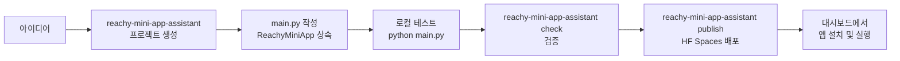
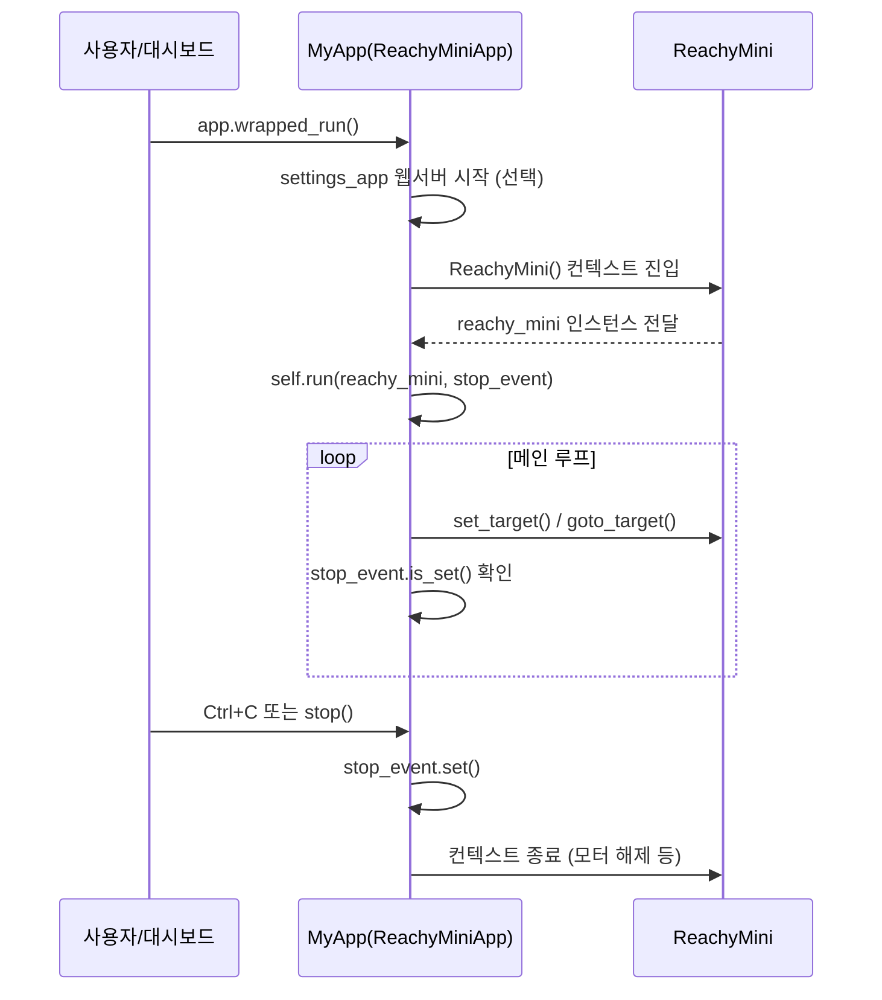
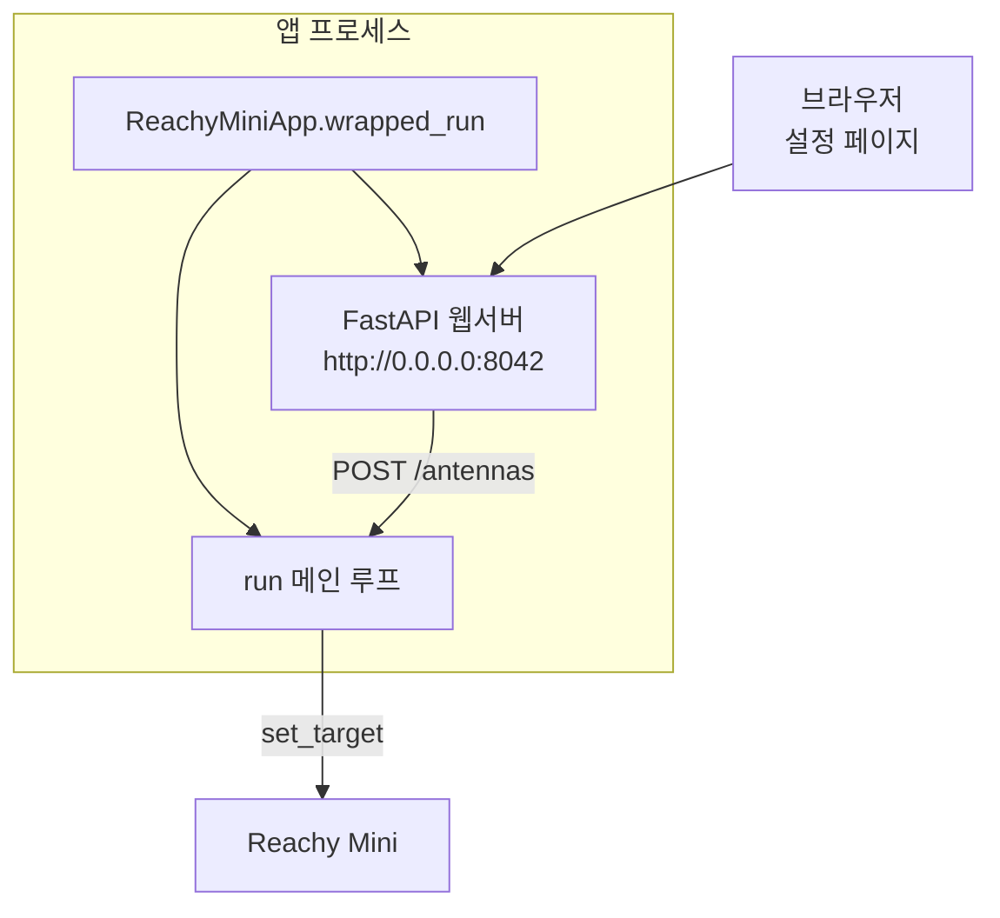
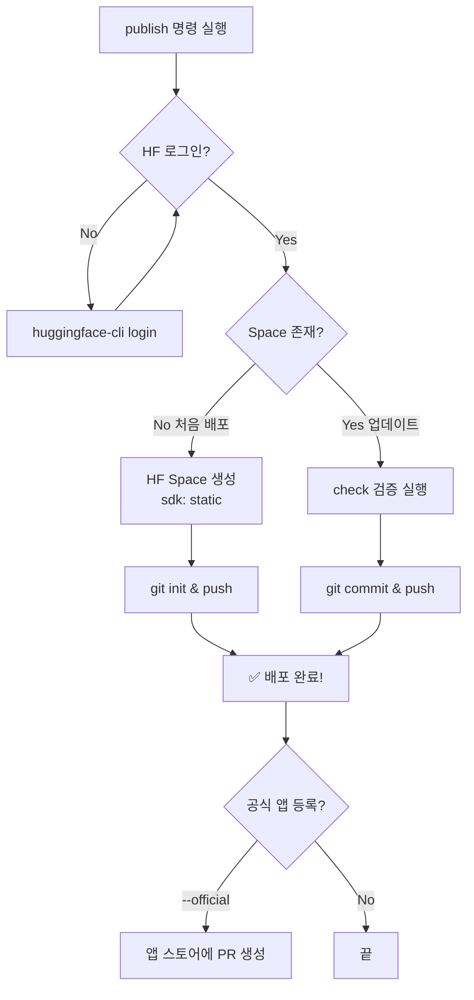

# Week 09: 앱 개발

## 학습 목표

- ReachyMiniApp 클래스 활용
- 독립 실행형 앱 구조 이해
- Hugging Face Spaces 배포

---

## 1. 개요

이번 주차에서는 지금까지 작성한 Python 스크립트를 **독립 실행형 Reachy Mini 앱**으로 패키징하는 방법을 학습합니다. `ReachyMiniApp` 클래스를 상속하여 표준화된 앱을 만들고, Hugging Face Spaces에 배포하여 다른 사용자가 대시보드에서 바로 설치·실행할 수 있게 합니다.

### 전체 워크플로우



---

## 2. ReachyMiniApp 클래스 이해

### 2.1 클래스 구조

`ReachyMiniApp`은 모든 Reachy Mini 앱의 **추상 베이스 클래스(ABC)**입니다. 이 클래스를 상속하고 `run()` 메서드를 구현하면 독립 실행형 앱이 됩니다.

```python
from abc import ABC, abstractmethod
import threading
from reachy_mini.reachy_mini import ReachyMini

class ReachyMiniApp(ABC):
    """Base class for Reachy Mini applications."""

    # 선택: 설정 웹 페이지 URL (None이면 설정 페이지 없음)
    custom_app_url: str | None = None
    # 선택: 웹서버 시작 여부
    dont_start_webserver: bool = False
    # 선택: 미디어 백엔드 지정 ("gstreamer", "default" 등)
    request_media_backend: str | None = None

    @abstractmethod
    def run(self, reachy_mini: ReachyMini, stop_event: threading.Event) -> None:
        """앱의 메인 로직. 반드시 구현해야 합니다."""
        pass

    def stop(self) -> None:
        """앱을 안전하게 종료합니다."""
        self.stop_event.set()
```

### 2.2 핵심 메서드 설명

| 메서드 | 설명 |
|--------|------|
| `run(reachy_mini, stop_event)` | **필수 구현**. 앱의 메인 로직을 담는 메서드 |
| `wrapped_run()` | `ReachyMini` 인스턴스를 생성하고 `run()`을 호출. 진입점 |
| `stop()` | `stop_event`를 설정하여 앱을 안전하게 종료 |

### 2.3 실행 흐름



> [!IMPORTANT]
> `run()` 내부의 메인 루프에서는 반드시 `stop_event.is_set()`를 주기적으로 확인해야 합니다. 그래야 대시보드나 `Ctrl+C`로 앱을 안전하게 종료할 수 있습니다.

---

## 3. 독립 실행형 앱 구조

### 3.1 프로젝트 생성

CLI 도구를 사용하여 앱 프로젝트를 자동 생성합니다:

```bash
# 가상환경 활성화
.venv\Scripts\activate

# 앱 프로젝트 생성 (대화형)
reachy-mini-app-assistant create my_first_app
```

### 3.2 생성되는 디렉터리 구조

```
my_first_app/                  ← 프로젝트 루트
├── pyproject.toml             ← 패키지 메타데이터 & 엔트리포인트
├── README.md                  ← HF Spaces 메타데이터 (태그 포함)
├── index.html                 ← HF Spaces 랜딩 페이지
├── style.css                  ← 랜딩 페이지 스타일
├── .gitignore
└── my_first_app/              ← Python 패키지
    ├── __init__.py
    ├── main.py                ← 앱 메인 코드 (ReachyMiniApp 상속)
    └── static/                ← 설정 웹 페이지 (선택)
        ├── index.html
        ├── style.css
        └── main.js
```

### 3.3 핵심 파일 설명

#### pyproject.toml

앱의 패키지 정보와 **엔트리포인트**를 정의합니다. 엔트리포인트를 통해 대시보드가 앱을 자동으로 인식합니다.

```toml
[build-system]
requires = ["setuptools>=61.0"]
build-backend = "setuptools.build_meta"

[project]
name = "my_first_app"
version = "0.1.0"
description = "나의 첫 Reachy Mini 앱"
readme = "README.md"
requires-python = ">=3.10"
dependencies = [
    "reachy-mini"
]
keywords = ["reachy-mini-app"]

# ★ 핵심: 이 엔트리포인트로 대시보드가 앱을 발견합니다
[project.entry-points."reachy_mini_apps"]
my_first_app = "my_first_app.main:MyFirstApp"
```

> [!NOTE]
> 엔트리포인트 형식: `앱이름 = "패키지.main:클래스명"`
> - 앱 이름이 `my_first_app`이면 클래스 이름은 `MyFirstApp`이 됩니다 (snake_case → PascalCase).

#### README.md

Hugging Face Spaces에 배포할 때 필요한 **YAML 메타데이터**를 포함합니다:

```yaml
---
title: My First App
emoji: 👋
colorFrom: red
colorTo: blue
sdk: static
pinned: false
short_description: 나의 첫 Reachy Mini 앱
tags:
 - reachy_mini                 # ★ 필수 태그
 - reachy_mini_python_app      # ★ 필수 태그
---
```

> [!IMPORTANT]
> `reachy_mini` 태그와 `reachy_mini_python_app` 태그가 반드시 포함되어야 합니다. 이 태그로 대시보드가 앱을 검색합니다.

#### main.py

앱의 핵심 로직이 담기는 파일입니다:

```python
import threading
import time

import numpy as np
from pydantic import BaseModel

from reachy_mini import ReachyMini, ReachyMiniApp
from reachy_mini.utils import create_head_pose


class MyFirstApp(ReachyMiniApp):
    # 설정 웹 페이지 URL (None이면 설정 페이지 없음)
    custom_app_url: str | None = "http://0.0.0.0:8042"
    # 미디어 백엔드 (None이면 자동 선택)
    request_media_backend: str | None = None

    def run(self, reachy_mini: ReachyMini, stop_event: threading.Event):
        t0 = time.time()

        antennas_enabled = True
        sound_play_requested = False

        # === 설정 웹 API 등록 (optional) ===
        class AntennaState(BaseModel):
            enabled: bool

        @self.settings_app.post("/antennas")
        def update_antennas_state(state: AntennaState):
            nonlocal antennas_enabled
            antennas_enabled = state.enabled
            return {"antennas_enabled": antennas_enabled}

        @self.settings_app.post("/play_sound")
        def request_sound_play():
            nonlocal sound_play_requested
            sound_play_requested = True
        # === 설정 웹 API 끝 ===

        # 메인 제어 루프
        while not stop_event.is_set():
            t = time.time() - t0

            # 머리 좌우 흔들기
            yaw_deg = 30.0 * np.sin(2.0 * np.pi * 0.2 * t)
            head_pose = create_head_pose(yaw=yaw_deg, degrees=True)

            # 안테나 움직임
            if antennas_enabled:
                amp_deg = 25.0
                a = amp_deg * np.sin(2.0 * np.pi * 0.5 * t)
                antennas_deg = np.array([a, -a])
            else:
                antennas_deg = np.array([0.0, 0.0])

            # 사운드 재생 요청 처리
            if sound_play_requested:
                reachy_mini.media.play_sound("wake_up.wav")
                sound_play_requested = False

            antennas_rad = np.deg2rad(antennas_deg)

            reachy_mini.set_target(
                head=head_pose,
                antennas=antennas_rad,
            )

            time.sleep(0.02)  # 50Hz 루프


# 독립 실행
if __name__ == "__main__":
    app = MyFirstApp()
    try:
        app.wrapped_run()
    except KeyboardInterrupt:
        app.stop()
```

---

## 4. 설정 웹 페이지 (선택 사항)

`custom_app_url`을 설정하면 앱 실행 시 **FastAPI 기반 웹 서버**가 자동으로 시작됩니다. `static/` 폴더의 `index.html`이 설정 페이지로 제공되며, FastAPI 엔드포인트를 추가하여 앱을 실시간으로 제어할 수 있습니다.

### 4.1 아키텍처



### 4.2 설정 페이지 예시

`static/index.html`에서 JavaScript로 앱의 API를 호출합니다:

```html
<!DOCTYPE html>
<html>
<head>
    <title>My App Settings</title>
    <link rel="stylesheet" href="/static/style.css">
</head>
<body>
    <h1>🤖 앱 설정</h1>
    <button onclick="toggleAntennas(true)">안테나 ON</button>
    <button onclick="toggleAntennas(false)">안테나 OFF</button>
    <button onclick="playSound()">사운드 재생</button>

    <script>
    async function toggleAntennas(enabled) {
        await fetch('/antennas', {
            method: 'POST',
            headers: {'Content-Type': 'application/json'},
            body: JSON.stringify({enabled: enabled})
        });
    }
    async function playSound() {
        await fetch('/play_sound', {method: 'POST'});
    }
    </script>
</body>
</html>
```

> [!TIP]
> 설정 페이지가 필요 없는 간단한 앱은 `custom_app_url = None`으로 설정하세요. 이렇게 하면 FastAPI 웹서버가 시작되지 않아 리소스를 절약할 수 있습니다.

---

## 5. 앱 검증 및 테스트

### 5.1 로컬 실행 테스트

먼저 시뮬레이션 환경에서 앱을 직접 실행하여 테스트합니다:

```bash
# 터미널 1: 데몬 실행 (시뮬레이션 모드)
reachy-mini-daemon --sim

# 터미널 2: 앱 실행
cd my_first_app
python my_first_app/main.py
```

### 5.2 CLI 검증 도구

`reachy-mini-app-assistant check` 명령으로 앱의 구조가 올바른지 자동 검증합니다:

```bash
reachy-mini-app-assistant check my_first_app
```

이 도구가 확인하는 항목:

| 검증 항목 | 설명 |
|-----------|------|
| `pyproject.toml` 존재 | 패키지 메타데이터 파일 확인 |
| `index.html`, `style.css` 존재 | HF Spaces 랜딩 페이지 파일 확인 |
| 패키지 폴더와 `__init__.py` | Python 패키지 구조 확인 |
| 엔트리포인트 설정 | `reachy_mini_apps` 그룹에 올바른 엔트리포인트 등록 확인 |
| `main.py`에 클래스 존재 | `ReachyMiniApp`을 상속하는 클래스 존재 확인 |
| `README.md` 메타데이터 | 필수 태그(`reachy_mini`, `reachy_mini_python_app`) 포함 확인 |
| 설치/제거 테스트 | 임시 가상환경에서 `pip install` → 엔트리포인트 확인 → `pip uninstall` |

출력 예시:
```
✅ index.html and style.css exist in the root of the app.
✅ pyproject.toml contains the correct entrypoint for the app.
✅ my_first_app/__init__.py exists.
✅ my_first_app/main.py exists.
✅ main.py contains the class MyFirstApp that inherits from ReachyMiniApp.
✅ README.md contains the required metadata.
✅ App entrypoint is registered correctly.
✅ App installation and uninstallation tests passed.
✅ App 'my_first_app' passed all checks!
```

---

## 6. Hugging Face Spaces 배포

### 6.1 사전 준비

1. **Hugging Face 계정 생성**: https://huggingface.co/join
2. **액세스 토큰 발급**: https://huggingface.co/settings/tokens 에서 `Write` 권한 토큰 생성
3. **HF CLI 로그인**:

```bash
# huggingface_hub가 설치되어 있어야 합니다
uv pip install huggingface_hub

# 로그인 (토큰 입력)
huggingface-cli login
```

### 6.2 배포 명령

```bash
reachy-mini-app-assistant publish my_first_app
```

이 명령은 다음을 자동으로 수행합니다:



### 6.3 배포 과정 상세

#### 처음 배포할 때

```bash
reachy-mini-app-assistant publish my_first_app
```

실행하면:
1. 앱 구조 검증 (`check`)
2. Space 공개/비공개 선택
3. `username/my_first_app` HF Space 생성 (SDK: static)
4. Git 초기화 및 `main` 브랜치로 푸시
5. **배포 완료!** → `https://huggingface.co/spaces/username/my_first_app`

#### 업데이트 배포

코드를 수정한 후 같은 명령어를 다시 실행하면 변경 사항만 커밋됩니다:

```bash
# 코드 수정 후
reachy-mini-app-assistant publish my_first_app
# → 커밋 메시지 입력 → 자동으로 push
```

#### 공식 앱 스토어 등록 요청

```bash
reachy-mini-app-assistant publish my_first_app --official
```

`--official` 플래그를 추가하면 Pollen Robotics의 공식 앱 스토어(`reachy-mini-official-app-store`)에 PR이 자동으로 생성됩니다.

### 6.4 배포 후 확인

배포가 완료되면 다음에서 앱을 확인할 수 있습니다:
- **HF Spaces 페이지**: `https://huggingface.co/spaces/사용자명/my_first_app`
- **Reachy Mini 대시보드**: 로봇 연결 후 대시보드에서 앱 검색 및 설치

---

## 7. 실전 예제: 물체 추적 앱

이전 주차에서 학습한 비전 모델을 활용하여 완성된 앱을 만들어 봅니다.

### 7.1 프로젝트 생성

```bash
reachy-mini-app-assistant create object_tracker
```

### 7.2 main.py 구현

```python
import threading
import time

import cv2
import numpy as np
import torch
from PIL import Image
from transformers import DetrForObjectDetection, DetrImageProcessor

from reachy_mini import ReachyMini, ReachyMiniApp
from reachy_mini.utils import create_head_pose


class ObjectTracker(ReachyMiniApp):
    custom_app_url: str | None = None  # 설정 페이지 불필요
    request_media_backend: str | None = None

    def run(self, reachy_mini: ReachyMini, stop_event: threading.Event):
        # 모델 로드
        processor = DetrImageProcessor.from_pretrained("facebook/detr-resnet-50")
        model = DetrForObjectDetection.from_pretrained("facebook/detr-resnet-50")

        # 프레임 카운터 (매 5프레임마다 추론)
        frame_count = 0
        last_offset_x = 0.0
        last_offset_y = 0.0

        while not stop_event.is_set():
            # 카메라 프레임 가져오기
            frame = reachy_mini.media.get_frame()
            if frame is None:
                time.sleep(0.1)
                continue

            frame_count += 1

            # 5프레임마다 물체 탐지
            if frame_count % 5 == 0:
                image = Image.fromarray(cv2.cvtColor(frame, cv2.COLOR_BGR2RGB))
                inputs = processor(images=image, return_tensors="pt")
                outputs = model(**inputs)

                target_sizes = torch.tensor([image.size[::-1]])
                results = processor.post_process_object_detection(
                    outputs, target_sizes=target_sizes, threshold=0.8
                )[0]

                for score, label, box in zip(
                    results["scores"], results["labels"], results["boxes"]
                ):
                    label_name = model.config.id2label[label.item()]
                    if label_name in ["bottle", "cup", "cell phone"]:
                        box = box.tolist()
                        center_x = (box[0] + box[2]) / 2
                        center_y = (box[1] + box[3]) / 2

                        img_h, img_w = frame.shape[:2]
                        last_offset_x = (center_x - img_w / 2) / img_w
                        last_offset_y = (center_y - img_h / 2) / img_h
                        break

            # 로봇 머리 제어 (부드럽게 추적)
            head_pose = create_head_pose(
                yaw=-last_offset_x * 30,
                pitch=-last_offset_y * 20,
                degrees=True,
            )
            reachy_mini.set_target(head=head_pose)

            time.sleep(0.02)


if __name__ == "__main__":
    app = ObjectTracker()
    try:
        app.wrapped_run()
    except KeyboardInterrupt:
        app.stop()
```

### 7.3 의존성 추가

`pyproject.toml`의 `dependencies`에 비전 관련 패키지를 추가합니다:

```toml
dependencies = [
    "reachy-mini",
    "transformers",
    "torch",
    "torchvision",
    "pillow",
    "opencv-python",
]
```

### 7.4 테스트 및 배포

```bash
# 1. 로컬 테스트
cd object_tracker
python object_tracker/main.py

# 2. 구조 검증
reachy-mini-make-app check .

# 3. HF Spaces 배포
reachy-mini-make-app publish .
```

---

## 8. 앱 이름 규칙 정리

앱 이름에는 몇 가지 규칙이 있습니다:

| 규칙 | 예시 |
|------|------|
| 소문자 + 밑줄 사용 | `my_first_app` ✅ |
| 하이픈(`-`) 사용 불가 | `my-first-app` ❌ |
| 공백 사용 불가 | `my first app` ❌ |
| 슬래시/백슬래시 불가 | `my/app` ❌ |
| 와일드카드 불가 | `my_app*` ❌ |

앱 이름으로부터 자동 생성되는 값:

| 항목 | 변환 규칙 | 예시 |
|------|-----------|------|
| 패키지명 | 그대로 사용 | `my_first_app` |
| 클래스명 | PascalCase 변환 | `MyFirstApp` |
| 엔트리포인트 | 그대로 사용 | `my_first_app` |

---

## 9. 실습 과제

### 과제 1: 인사 앱 만들기
로봇이 사람을 인식하면(DETR의 `person` 클래스) 고개를 끄덕이고 안테나를 흔드는 `greeting_app`을 만들어 보세요.

### 과제 2: 설정 페이지 추가
과제 1의 앱에 설정 페이지를 추가하여, 브라우저에서 인사 동작의 속도와 안테나 움직임을 실시간으로 조절할 수 있게 만들어 보세요.

### 과제 3: HF Spaces 배포
완성된 앱을 Hugging Face Spaces에 배포하고, `reachy-mini-make-app check`가 모든 항목을 통과하는지 확인하세요.

---

## 10. 참고 자료

- [Reachy Mini Build Guide (공식 문서)](https://github.com/pollen-robotics/reachy_mini/blob/main/docs/old_doc/build.md)
- [Hugging Face Spaces 가이드](https://huggingface.co/docs/hub/spaces)
- [FastAPI 공식 문서 (설정 페이지용)](https://fastapi.tiangolo.com/)

---

**작성일**: 2025-02-21  
**환경**: Windows + MuJoCo 시뮬레이션 + reachy-mini SDK  
**관련 리포지토리**: https://github.com/orocapangyo/reachy_mini
